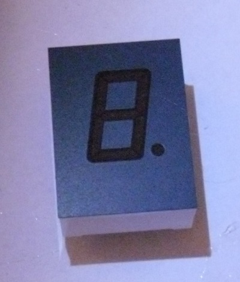
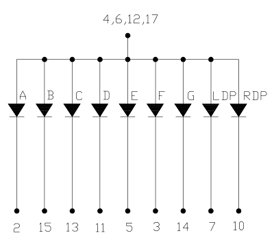

LTS-4848JR
==========

Links:

- [Ähnliche Webseite](http://www.pollin.de/shop/dt/MzcwOTc4OTk-/Bauelemente_Bauteile/Aktive_Bauelemente/Displays/LED_Anzeige_LITEON_LTS_3401VE.html)

Dies ist das einfachste Display. Beim Anschließen unbedingt einen Widerstand vor das Plus schalten, damit die LEDs nicht durchbrennen.  
Das ist die Schaltung in der Anzeige:  

