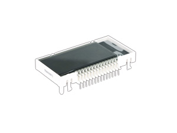

LED-Anzeigen
============

Bevor man eine von den Anzeigen benutzt, sollte man das [LED-Tutorial](http://starthardware.org/) machen. Dort steht drin, wie man die LED-Anzeigen anschließt.
Danach wird diese Reihenfolge empfohlen:

  
  
  

Die Anzeigen kann man kaputt machen. Deswegen einen Vorwiderstand verwenden, um sie nicht durchschmoren zu lassen.

