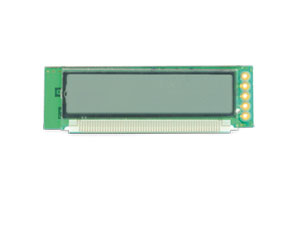

LED-Anzeigen
============

Bevor man eine von den Anzeigen benutzt, sollte man das [LED-Tutorial](http://starthardware.org/) machen. Dort steht drin, wie man die LED-Anzeigen anschließt.
Die LED-Anzeigen kann man kaputt machen. Deswegen einen Vorwiderstand verwenden, um sie nicht durchschmoren zu lassen.

Danach wird diese Reihenfolge empfohlen:

  
  
  

Weitere Links
-------------

- Ein [Thread zum Thema](http://www.mikrocontroller.net/topic/354824).
- Das LED-, LCD-, Fluoreszenz-Anzeigen-Sortiment von [Pollin](http://www.pollin.de/shop/dt/ODk5OTkxOTk-/Bauelemente_Bauteile/Sortimente/Aktive_Bauteile/LED_LCD_Fluoreszenz_Anzeigen.html).
