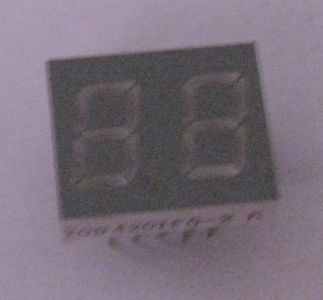
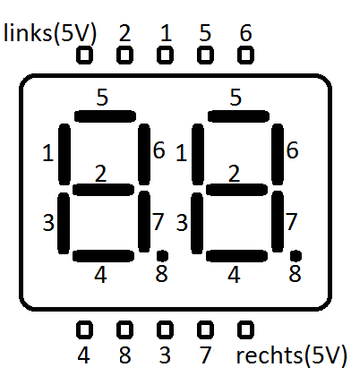

TOD 4201FG
==========

 

Wie auch bei [LTS-4848JR](../LTS-4848JR) muss hier ein Vorwiderstand verwendet werden, wenn man links oder rechts anschließt. Man kann zwei verschiedene Zahlen anzeigen, indem man schnell zwischen den beiden rechts und links wechselt. Dann leuchten beide nur halb so hell, weil sie nur die Hälfte der Zeit leuchten.