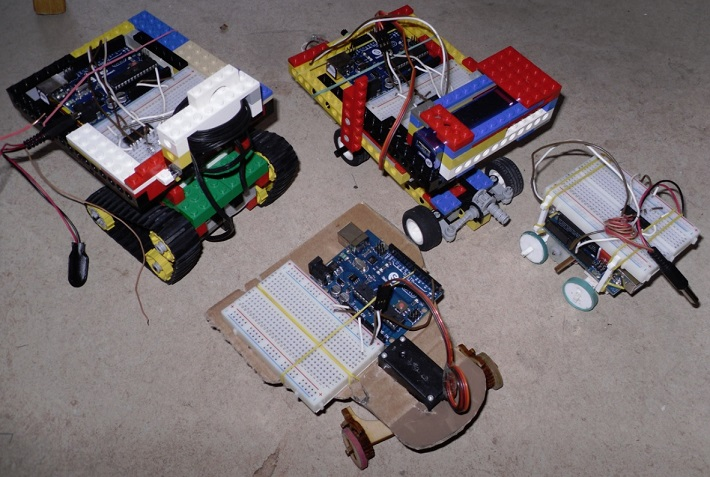
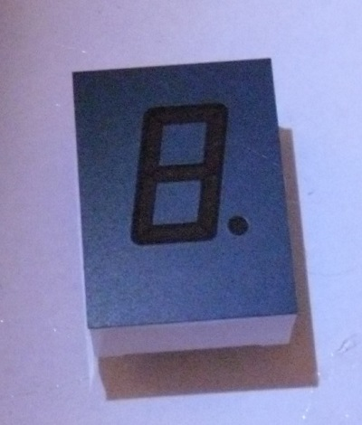
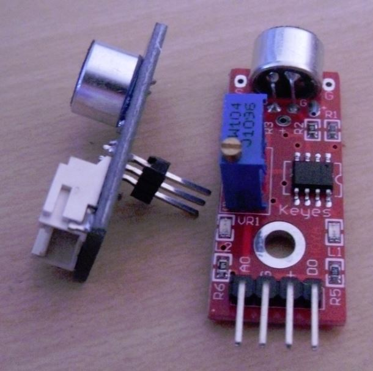

Material
========

Dieses Material wurde für das [Coder Dojo Potsdam](http://zen.coderdojo.com/dojo/861) erstellt.

Roboter [leicht]
-------

Diese Roboter gibt es beim Coder Dojo Potsdam.

[Zum Material](roboter)

Anzeigen
--------

Programmieraufgaben
-------------------

Diese [Programmieraufgaben](programmieraufgaben/arduino) kannst du mit dem Arduino lösen.

Robochallenge [schwer]
-------------

Fahre die Roboter zum Lautsprecher. Ein Mikrofon sagt dir, wie laut der Ton ist.

[Zum Material](tonerkennung)

Lizenz
------

  
Dieses Werk von [https://github.com/CoderDojoPotsdam](https://github.com/CoderDojoPotsdam) ist lizenziert unter einer [Creative Commons Namensnennung 4.0 International Lizenz](http://creativecommons.org/licenses/by/4.0/).  
Sollten Unterordner davon abweichen, wird dies explizit gekennzeichnet.

