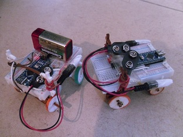

John
====

Der Beispielquelltext befindet sich in der Datei [john.ino](john.ino). Er muss verändert werden und in eine neue Datei abgespeichert werden.

Der Roboter kann nur vorwärts und rückwärts fahren. Beim Rückwärtsfahren lenkt er aber ein.
Mit etwas Geschick kann man ihn sogar beherrschen.

Wie man ihn nicht beherrscht, zeigt der Beispielquelltext: 

    void loop () {
      fahre_vor();
      delay(1000);
      fahre_zurueck();
      delay(1000);
    }

Es stehen die Funktionen `fahre_vor()`, `fahre_zurueck()` und `anhalten()` in der Datei.

Motoransteuerung
----------------

Dieser Roboter verwendet eine [H-Brücke](../hbruecke) zur Ansteuerung des Motors.

Repository
----------

John ist ein ein lasergeschnittener Roboter und wird in einem [anderen Repository](https://github.com/niccokunzmann/rustyrobots) verwaltet.

