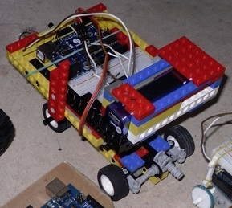

Legoauto
========

Der Beispielquelltext befindet sich in der Datei [legoauto.ino](legoauto.ino). Er muss verändert werden und in eine neue Datei abgespeichert werden.

Das Beispielprogramm sieht so aus:

    void loop() {
      lenke_rechts();
      fahre_rueckwaerts();
      delay(1000);  
      lenke_links();
      fahre_vorwaerts();
      delay(1000);
    }

Alles, was in einer Zeile nach `//` steht, ist ein Kommentar und wird vom Compiler ignoriert.

    // Wird vom Compiler ignoriert

Was zwischen `/*` und `*/` steht, wird auch ignoriert.

    /* wird ignoriert */

Die Erklärungen stehen in der Datei immer in solchen Kommentaren.

Motoransteuerung
----------------

Dieser Roboter verwendet eine [H-Brücke](../hbruecke) zur Ansteuerung des Motors.

