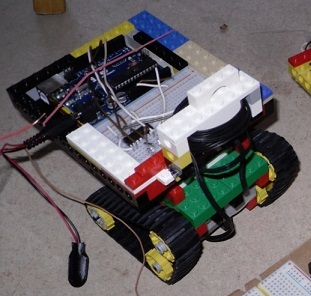

Legokettenfahrzeug
==================

Der Beispielquelltext befindet sich in der Datei [legokettenfahrzeug.ino](legokettenfahrzeug.ino). Er muss verändert werden und in eine neue Datei abgespeichert werden.

Man ruft in `void loop(){ ... }` die Funktion `fahre(int links, int rechts)` auf. 

Ein Programm, das zwei Sekunden vorwärts und eine Sekunde rückwärts fährt, sieht so aus: 

    void loop() {
      fahre(255, 255)   // vorwaerts
      delay(2000);        // fuer zwei Sekunden
    
      fahre(-255, -255) // rueckwaerts
      delay(1000);        // fuer eine Sekunde
    }

Der restliche Inhalt der [legokettenfahrzeug.ino](legokettenfahrzeug.ino)-Datei muss natürlich trotzdem da sein.

Wenn man lenken möchte, benutzt man verschiedene Stärken für links und rechts:

    fahre(255, 0)

fährt links mehr.

    fahre(0, 127)

fährt auf halber Kraft rechts, mit null Kraft links.

    fahre(0, -255)

fährt mit voller Kraft rechts rückwärts.

Die Kräfte kann man beliebig kombinieren. 

Motoransteuerung
----------------

Dieser Roboter verwendet eine [H-Brücke](../hbruecke) zur Ansteuerung des Motors.