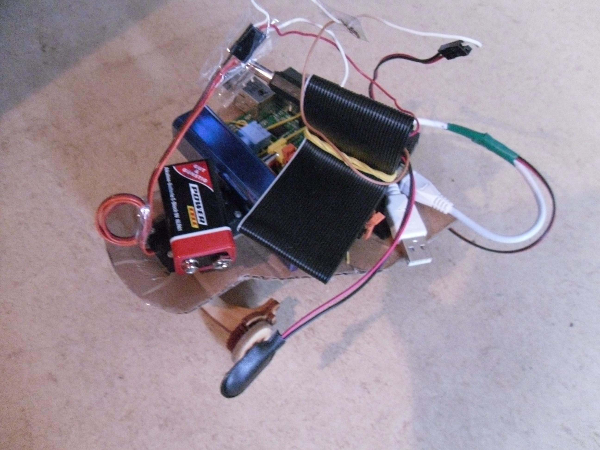

Rödel
=====

Ein Beispielquelltext kann [hier](http://tinyurl.com/oxk6ch7) eingesehen werden.

Dieser Roboter kann mit Blockly-Blöcken programmiert werden. Gut ist, erstmal [Blockly](https://blockly-games.appspot.com/) zu programmieren, um die ganzen  Möglichkeiten auch ausschöpfen zu können. Dann kann der Roboter auf der [Übersichtsseite](http://rustyrobots.pythonanywhere.com) ausgewählt werden.